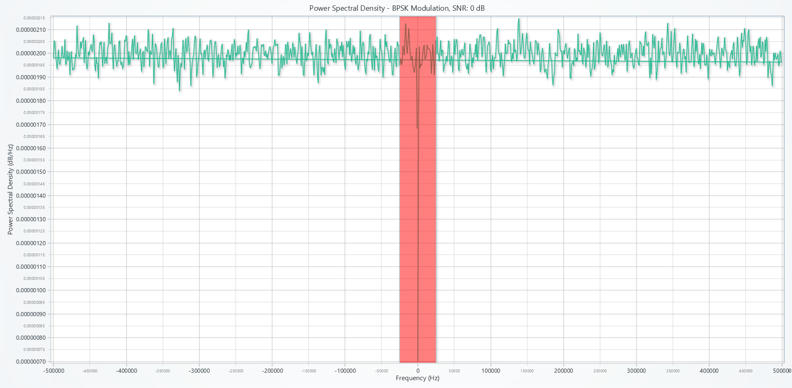
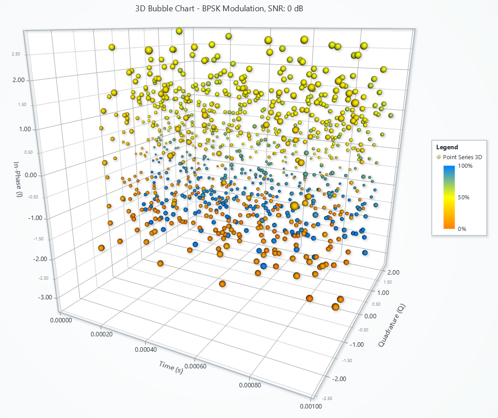
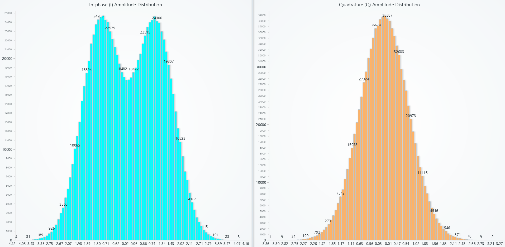
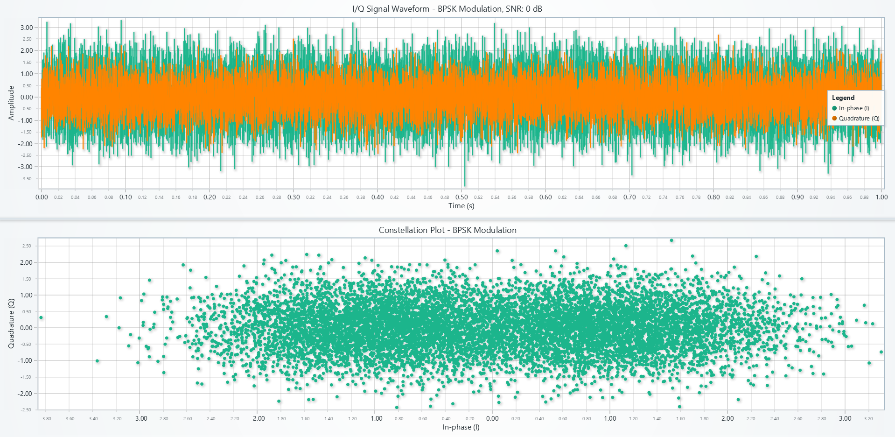

# Visualization of Radio Frequencies with LightningChart Python

## Introduction to Signal Analysis and Visualization for Communication Systems
### What is Signal Analysis?
Signal analysis is the process of examining, interpreting, and extracting meaningful information from signals, such as radio frequency (RF) signals. It plays a critical role in understanding communication systems, identifying signal characteristics, and improving system performance.

### Importance of Visualization in Communication Systems
Visualization bridges the gap between raw signal data and actionable insights. By using advanced visualization tools, engineers can identify patterns, detect anomalies, and optimize communication channels more effectively.

### Significance of Signal Analysis for Communication Systems
Signal analysis enables:
- **Efficient Spectrum Utilization:** Analyze frequency bands to optimize usage.
- **Error Detection:** Identify noise and signal distortions.
- **System Improvement:** Enhance modulation schemes and error correction techniques.

---

## Understanding the Dataset for Signal Analysis
### Key Features of the Dataset
This synthetic dataset is tailored for communication systems analysis, including:
- **Modulations:** BPSK, QPSK, 8PSK, and 16QAM.
- **Signal-to-Noise Ratios (SNR):** 0 dB, 5 dB, 10 dB, and 20 dB.
- **Sampling Rates:** 1 MHz, 2 MHz, and 5 MHz.
- **Carrier Frequencies:** 100 MHz, 200 MHz, and 400 MHz.

### Dataset Parameters and Their Relevance
- **Modulations:** Define the signal encoding scheme.
- **SNRs:** Represent signal quality under varying noise conditions.
- **Sampling Rates:** Indicate signal resolution and bandwidth.
- **Carrier Frequencies:** Reflect the spectral position of the signal.

---

## LightningChart Python
### Overview of LightningChart Python
LightningChart Python is a high-performance library for interactive data visualization, ideal for handling complex datasets like RF signals.

### Features and Chart Types Used in the Project
1. **Power Spectral Density (PSD) Line Charts**
2. **3D Bubble Charts**
3. **Amplitude Distribution Histograms**
4. **I/Q Waveform and Constellation Diagrams**
5. **Real-Time Streaming Charts**

### Performance Characteristics
- **High Performance:** Handles large datasets with low latency.
- **Interactivity:** Features zooming, panning, and tooltips.
- **Customizability:** Allows users to tailor visualizations for specific use cases.

---

## Setting Up Python Environment
### Installing Python and Necessary Libraries
Install the required libraries:
```bash
pip install numpy lightningchart scipy h5py
```

### Overview of Libraries Used
- **NumPy:** Numerical operations for signal processing.
- **SciPy:** Advanced scientific computing, including signal analysis.
- **LightningChart:** High-performance visualization.
- **h5py:** Handling HDF5 data files.

### Setting Up Your Development Environment
1. Set up a virtual environment:
```bash
python -m venv rf_analysis_env
source rf_analysis_env/bin/activate  # On Windows: rf_analysis_env\Scripts\activate
```
2. Use **Visual Studio Code (VSCode)** for a streamlined development experience.

---

## Loading and Processing Data
### Overview of the Dataset
The dataset contains I/Q signals stored in HDF5 format, with metadata including modulation type, SNR, sampling rate, and carrier frequency.

### How to Load the Data Files
Load the dataset using `h5py`:
```python
import h5py

file_path = 'Dataset/rf_dataset.h5'
with h5py.File(file_path, 'r') as f:
    sample_group = f['sample_0']
    iq_signal = sample_group['iq_signal'][:]  # Extract I/Q signal
```

### Handling and Preprocessing the Data
- Combine I and Q components into a complex signal:
```python
complex_signal = iq_signal[:, 0] + 1j * iq_signal[:, 1]
```
- Apply normalization for better visualization:
```python
normalized_signal = (complex_signal - np.min(complex_signal)) / (np.max(complex_signal) - np.min(complex_signal))
```

---

## Visualizations

### 1. Power Spectral Density (PSD)
**Description:**  
This chart visualizes the frequency domain representation of a signal's power. Welch's method is used for computing the Power Spectral Density (PSD).

**Results:**  
- The central band highlights the frequency range with the most signal energy.
- Signals exhibit varying spectral power depending on the modulation type and SNR.

**Use Cases:**  
- **Spectrum Analysis:** Identify occupied and unoccupied spectral regions.
- **Signal Quality Assessment:** Compare power distribution at different SNRs.
- **Interference Detection:** Spot anomalies in the frequency spectrum.

**Script Snippet:**
```python
from scipy.signal import welch
import lightningchart as lc

freqs, psd = welch(complex_signal, fs=sampling_rate, nperseg=1024)

chart = lc.ChartXY(
    theme=lc.Themes.Light,
    title=f'Power Spectral Density - {modulation} Modulation, SNR: {snr} dB'
)
line_series = chart.add_line_series()
line_series.add(freqs, psd)

x_axis = chart.get_default_x_axis().set_title('Frequency (Hz)')
chart.get_default_y_axis().set_title('Power Spectral Density (dB/Hz)')

# Highlight specific frequency bands
band = x_axis.add_band()
band.set_value_start(-25000)
band.set_value_end(25000)
band.set_color(lc.Color(255, 0, 0, 128))

chart.open()
```
  

---

### 2. 3D Bubble Chart - I/Q Signal Representation
**Description:**  
This 3D chart represents the time evolution of the I/Q signal, with bubble size indicating signal magnitude and color encoding signal phase.

**Results:**  
- Signal distribution and intensity vary over time.
- Phase differences are clearly visualized through color gradients.

**Use Cases:**  
- **Signal Trajectory Analysis:** Examine the temporal evolution of modulated signals.
- **Phase Variations:** Evaluate phase shifts caused by channel effects.
- **Signal Integrity:** Detect anomalies in magnitude and phase.

**Script Snippet:**
```python
magnitude = np.sqrt(iq_signal[:, 0]**2 + iq_signal[:, 1]**2)
phase = np.arctan2(iq_signal[:, 1], iq_signal[:, 0])

chart = lc.Chart3D(
    title=f'3D Bubble Chart - {modulation} Modulation, SNR: {snr} dB',
    theme=lc.Themes.Light
)

series = chart.add_point_series(
    render_2d=False,
    individual_point_color_enabled=True,
    individual_lookup_values_enabled=True
)

series.set_point_shape('sphere')
series.set_palette_point_colors(
    steps=[
        {'value': 0.0, 'color': lc.Color('blue')},
        {'value': 0.5, 'color': lc.Color('yellow')},
        {'value': 1.0, 'color': lc.Color('red')}
    ],
    look_up_property='value',
    percentage_values=True
)

# Add data to the chart
time_axis = np.arange(len(magnitude)) / sampling_rate
data = [{'x': t, 'y': iq_signal[idx, 0], 'z': iq_signal[idx, 1], 'size': mag * 10, 'value': ph}
        for idx, (t, mag, ph) in enumerate(zip(time_axis, magnitude, phase))]

series.add(data)
chart.open()
```
  

---

### 3. Amplitude Distribution Histograms
**Description:**  
Bar charts display the amplitude distribution for the in-phase (I) and quadrature (Q) components.

**Results:**  
- Symmetric distributions reflect modulation schemes like BPSK and QPSK.
- Amplitude variations across components are clearly distinguishable.

**Use Cases:**  
- **Modulation Scheme Identification:** Distinguish between modulation types based on amplitude profiles.
- **Error Analysis:** Detect unexpected variations in amplitude distributions.

**Script Snippet:**
```python
counts_in_phase, bin_edges_in_phase = np.histogram(iq_signal[:, 0], bins=100)
counts_quadrature, bin_edges_quadrature = np.histogram(iq_signal[:, 1], bins=100)

# Prepare data for the bar charts
bar_data_in_phase = [
    {"category": f"{bin_edges_in_phase[i]:.2f}-{bin_edges_in_phase[i+1]:.2f}", "value": int(count)}
    for i, count in enumerate(counts_in_phase)
]

bar_data_quadrature = [
    {"category": f"{bin_edges_quadrature[i]:.2f}-{bin_edges_quadrature[i+1]:.2f}", "value": int(count)}
    for i, count in enumerate(counts_quadrature)
]

dashboard = lc.Dashboard(columns=2, rows=1, theme=lc.Themes.Light)

chart_in_phase = dashboard.BarChart(row_index=0, column_index=0)
chart_in_phase.set_title('In-phase (I) Amplitude Distribution')
chart_in_phase.set_data(bar_data_in_phase)

chart_quadrature = dashboard.BarChart(row_index=0, column_index=1)
chart_quadrature.set_title('Quadrature (Q) Amplitude Distribution')
chart_quadrature.set_data(bar_data_quadrature)

dashboard.open()
```
  

---

### 4. I/Q Signal Waveform and Constellation
**Description:**  
The dashboard includes:
- **Waveform Plot:** Temporal representation of I and Q components.
- **Constellation Plot:** Scatterplot of I vs. Q components to represent modulation schemes.

**Results:**  
- Temporal trends reveal noise and signal strength.
- Constellation diagrams show clustering patterns specific to modulation types.

**Use Cases:**  
- **Modulation Analysis:** Verify signal conformity to expected modulation types.
- **Noise Impact Study:** Assess distortion effects due to channel noise.

**Script Snippet:**
```python
dashboard = lc.Dashboard(columns=1, rows=2, theme=lc.Themes.Light)

# I/Q Waveform
waveform_chart = dashboard.ChartXY(row_index=0, column_index=0)
waveform_chart.set_title(f'I/Q Signal Waveform - {modulation} Modulation, SNR: {snr} dB')

time_axis = np.arange(len(iq_signal)) / sampling_rate
waveform_chart.add_line_series().set_name('In-phase (I)').add(time_axis, iq_signal[:, 0])
waveform_chart.add_line_series().set_name('Quadrature (Q)').add(time_axis, iq_signal[:, 1])

# Constellation Plot
constellation_chart = dashboard.ChartXY(row_index=1, column_index=0)
constellation_chart.set_title(f'Constellation Plot - {modulation} Modulation')

constellation_chart.add_point_series().add(iq_signal[:, 0], iq_signal[:, 1])

dashboard.open()
```


---

### 5. Real-Time Streaming: Bar Chart Equalizer
**Description:**  
A real-time bar chart visualizes frequency spectrum updates over streaming data.

**Results:**  
- Smooth spectrum transitions highlight dynamic frequency shifts.
- Noise and signal trends are immediately observable.

**Use Cases:**  
- **Live Signal Monitoring:** Track frequency content in real time.
- **Spectral Efficiency Analysis:** Analyze bandwidth utilization over time.

**Script Snippet:**
```python
from scipy.fftpack import fft

frame_size = 1000
frequencies = np.fft.rfftfreq(frame_size, d=1 / sampling_rate)

chart = lc.BarChart(title="Frequency Spectrum Equalizer Streaming", theme=lc.Themes.Dark)
chart.set_animation_values(True)

def stream_data():
    for start in range(0, len(signal), frame_size):
        frame_signal = signal[start:start + frame_size]
        spectrum = np.abs(fft(frame_signal)[:len(frequencies)])

        # Normalize spectrum values
        normalized_spectrum = spectrum / np.max(spectrum)

        # Prepare bar data
        bar_data = [{"category": f"{freq/1e3:.0f} kHz", "value": val} for freq, val in zip(frequencies, normalized_spectrum)]
        chart.set_data(bar_data)

        time.sleep(0.1)

stream_data()
chart.open()
```
  

---

### 6. Frequency Spectrum (Streaming Line Chart)
**Description:**  
A line chart dynamically visualizes the streaming frequency spectrum over time, with amplitude-based color gradients.

**Results:**  
- Streaming data shows amplitude variations in real time.
- Color gradients help highlight spectral peaks and troughs.

**Use Cases:**  
- **Dynamic Spectrum Allocation:** Optimize spectrum usage dynamically.
- **Anomaly Detection:** Spot spectral peaks caused by interference.

**Script Snippet:**
```python
frequencies = np.fft.rfftfreq(frame_size, d=1 / sampling_rate)

chart = lc.ChartXY(title="Frequency Spectrum (Streaming)", theme=lc.Themes.Dark)
line_series = chart.add_line_series()

for start in range(0, len(signal), frame_size):
    frame_signal = signal[start:start + frame_size]
    spectrum = np.abs(fft(frame_signal)[:len(frequencies)])

    line_series.clear()
    line_series.add(frequencies, spectrum)

    time.sleep(0.5)

chart.open()
```


---

### 7. 3D Amplitude Histogram
**Description:**  
A 3D histogram represents amplitude distributions over frequency bins, with color gradients indicating density.

**Results:**  
- Clear visualization of amplitude variations across the RF spectrum.
- Higher density bins highlight dominant signal components.

**Use Cases:**  
- **Amplitude Clustering:** Analyze signal amplitude clustering patterns.
- **Frequency Band Evaluation:** Assess signal behavior over different bands.

**Script Snippet:**
```python
histogram_data = []
for idx, amp in enumerate(amplitudes):
    hist, bins = np.histogram(amp, bins=10)
    for bin_idx in range(len(hist)):
        bin_center = (bins[bin_idx] + bins[bin_idx + 1]) / 2
        histogram_data.append({
            'xCenter': idx,
            'yCenter': hist[bin_idx],
            'zCenter': bin_center,
            'xSize': 0.8,
            'ySize': hist[bin_idx],
            'zSize': bins[bin_idx + 1] - bins[bin_idx]
        })

chart = lc.Chart3D(title='3D Amplitude Histogram')
box_series = chart.add_box_series()
box_series.add(histogram_data)

chart.open()
```


---

## Conclusion
This project demonstrates the versatility of LightningChart in visualizing signal data for wireless communication analysis. By exploring different visualization techniques, from power spectral density to real-time streaming, users gain actionable insights into signal behavior and channel characteristics.
